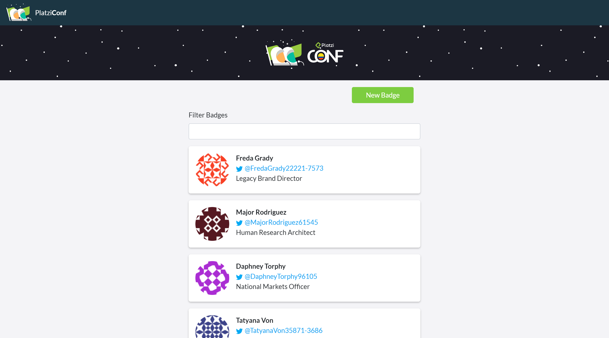
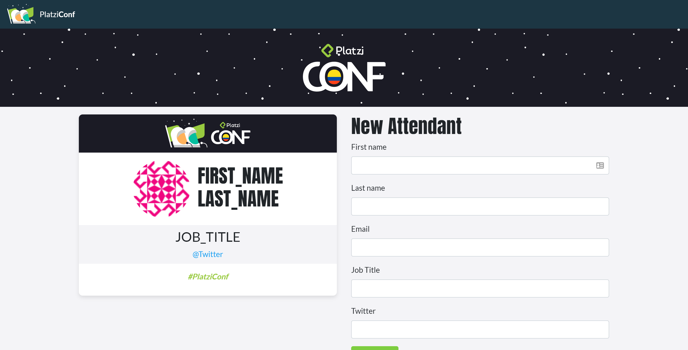

# Platzi Badges

Proyecto de aprendizaje: Platzi badges es un una web para crear badges de los asistententes a la Platziconf de Platzi.

## Home

## Lista de badges

## Crear un badge

## ¿Cómo funciona?

Requiere Node.JS 12

- `npm install` para instalar las dependencias.
- `npm start` para el entorno de desarrollo.

Cuenta un un server json-server para facilitar el manejo de la información.

## Licencia

[MIT License](LICENSE)
